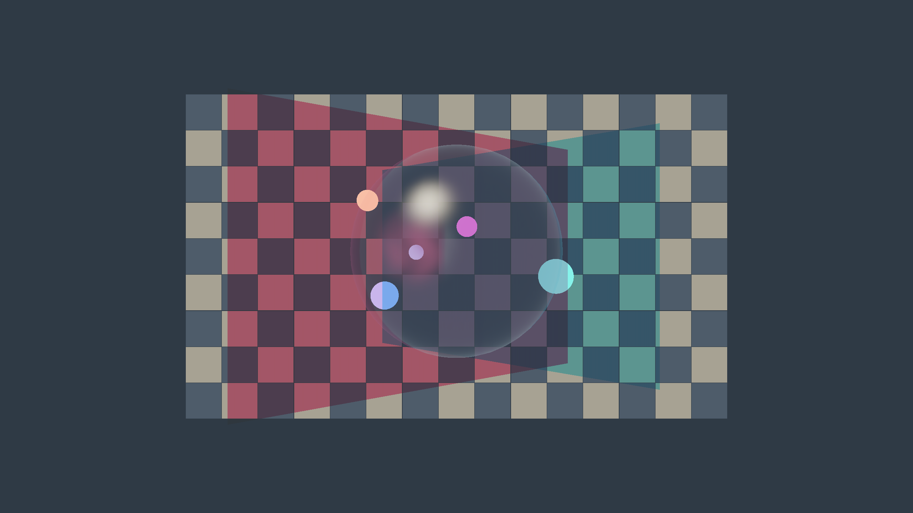
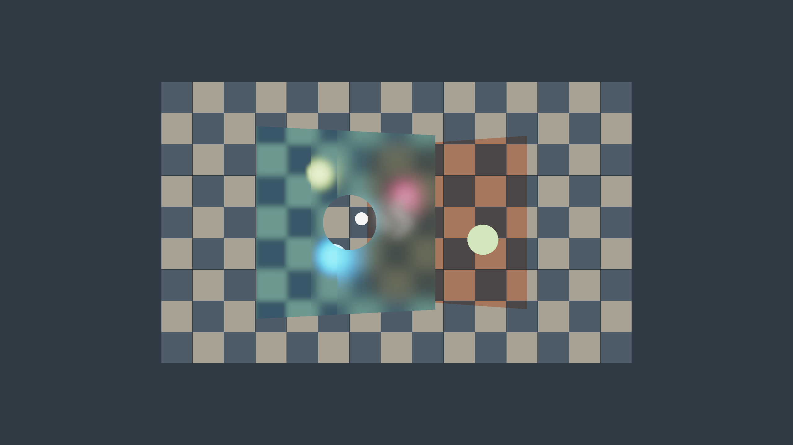

# avboit-exp

一个基于 **DX12 / C++17 / HLSL** 的 AVBOIT 实验，加入了磨砂玻璃、屏幕空间折射和独立 VFX 扭曲。
窗口、场景和 ImGui 使用 Donut；GPU 提交使用 NVRHI；透明算法位于独立的 `avboit/render` 模块。

这是根据 Michal Drobot 的 SIGGRAPH 2025 公开演讲独立实现的研究原型，
不是 Activision 源码，也不宣称是论文的官方参考实现。

[快速启动](#快速启动) · [管线说明](docs/PIPELINE.zh-CN.md) · [已知限制](docs/KNOWN_LIMITATIONS.zh-CN.md)

| OIT：顺序无关透明 | 磨砂玻璃 |
|---|---|
|  |  |
| 红色与青色玻璃相交，并与透明球、烟雾叠加；绘制提交无需按深度排序。 | 材质控制 Gaussian 模糊宽度；竖条粗糙度渐变，HDR 光斑被扩散，圆孔用于对照清晰背景。 |

两张图均为 **2560×1440 DX12 实机截图**，使用默认 packed accumulation 和程序化几何。
点击图片查看原尺寸；不依赖外部模型。

<details>
<summary>查看 OIT 正序／反序提交对比与截图命令</summary>

相机、几何与动画时间完全相同，仅改变透明 draw 的提交顺序。
OIT 图关闭了磨砂与折射，以便观察透明层的交叠关系。

| 原始提交顺序 | 反转提交顺序 |
|---|---|
|  |  |

R11G11B10 浮点混合不保证逐位一致。这两张截图的显示 RGB 平均绝对差为 **0.030/255**，
最大差为 **3/255**；渲染没有逐物体深度排序步骤。

```powershell
bin/avboit_viewer.exe --headless --stress 5 --no-frost --refraction-gain 0 --emissive-balls --time 0.7 --submission-order 0
bin/avboit_viewer.exe --headless --stress 5 --no-frost --refraction-gain 0 --emissive-balls --time 0.7 --submission-order 1
bin/avboit_viewer.exe --headless --stress 10 --emissive-balls --refraction-gain 0 --frost-mips 3
```

每次运行向当前目录写入 `native-raster.ppm` 及诊断数据，执行下一条命令前请保存图片。
README 中的 PNG 仅做无损格式转换，没有拼接或修图。

</details>

## 快速启动

需要 Windows x64、Visual Studio 2022 C++ 工具和 Windows SDK、CMake 3.18+、Python 3.9+、DX12 GPU。

编译并启动默认程序化场景：

```powershell
git clone --recursive https://github.com/yangrc1234/avboit-exp.git
cd avboit-exp
python build_native.py
.\bin\avboit_viewer.exe
```

**Sponza 不随 clone 附带，编译也不会自动下载。** 需要时在仓库根目录执行：

```powershell
python tools/fetch_sponza.py
.\bin\avboit_viewer.exe --sponza
```

下载后不用重新编译，也可以在 ImGui 中选择 **Background → Sponza**。
Sponza 的独立许可见 [第三方授权](THIRD_PARTY_NOTICES.md)。

默认 **2560×1440、120 FPS**；场景、画质和 Scene fixtures 均可在 ImGui 中即时切换。
WASD/QE 移动、右键转视角、Home 复位；B 切换 bilinear/bicubic，G 开关磨砂，V 开关 VFX，空格暂停动画。

## 当前方案

- occupancy + adaptive Z，packed atomic extinction，RGBA8 的 T-LUT；默认 XY 为 1/8，Z 为 128 slices。
- 全分辨率 `N / A / totalTau / BackN` 四 MRT，支持 RGB transmittance。
- 每像素选最近的特殊界面；支持同一界面的折射 + 磨砂。
- B′ 只缓存透明 tile 及一像素边界；其他源位置直接读取 opaque。
- 材质定义屏幕空间模糊宽度，不依赖背景深度；默认 3 级 Gaussian，更高档增加精细 mip。
- 主 Resolve 写临时 tile color，再拷回 SceneColor；VFX offset 与 HDR apply 独立。
- RenderDoc marker、shader 源码调试信息、occupancy overlay、每 pass GPU 计时。

详细公式和资源表：[当前管线](docs/PIPELINE.zh-CN.md)。
材质提交边界：[actor/material draws](docs/MATERIAL_DRAWS_ZH.md)。
局限包括单特殊界面、屏幕空间前景采样、packed 精度和高 overdraw 溢出、Zero-T 的量化与空间近似，
以及未接入 TAA/MSAA，见 [已知限制](docs/KNOWN_LIMITATIONS.zh-CN.md)。

## 测试与发布包

```powershell
python build_native.py --tests
python tools/package_runtime.py --output dist/avboit-exp
python tools/check_runtime_package.py --package dist/avboit-exp
```

测试 exe/shader 位于 `build/tests/bin`，不进入运行包。`--cpu-tests` 用于没有 DX12 GPU 的 CI。
GPU 测试串行执行；画质验证默认 2K，小尺寸用例只验证资源尺寸处理。
测性能时使用 StablePowerState，避免把频率波动误当优化收益；正常交互不启用该模式。

代码格式、回归入口见 [贡献说明](CONTRIBUTING.md) 和 [验证记录](docs/VALIDATION.md)。
代码采用 MIT，保留 NVIDIA 上游版权。第三方依赖、Sponza 的许可单列于
[授权清单](THIRD_PARTY_NOTICES.md)，项目 MIT 不替代它们的许可。
